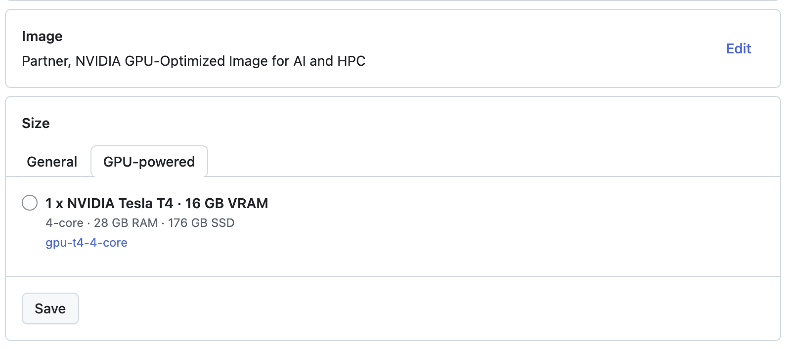

title: Run your GPU tests with GitHub Actions!
use_katex: False
class: title-slide

# Run your GPU tests with GitHub Actions!

.g.g-center[
.g-6[

]
.g-6[

]
]

.larger[Thomas J. Fan]<br>
<a href="https://www.github.com/thomasjpfan" target="_blank" class="title-link"><span class="icon icon-github right-margin"></span>@thomasjpfan</a>
<a class="this-talk-link", href="https://github.com/thomasjpfan/numfocus-summit-2024-gpu-ci" target="_blank">github.com/thomasjpfan/numfocus-summit-2024-gpu-ci</a>

---

# Overview 📖

.g.g-middle[
.g-6[
- Logistics & Getting Access
- scikit-learn's Approach
]
.g-6.g-center[

]
]

---

# Logistics & Getting Access 🛠️

.g.g-middle[
.g-6[
- **GitHub Teams**
- [Github docs on hosted runners](https://docs.github.com/en/actions/using-github-hosted-runners/using-larger-runners/about-larger-runners)
]
.g-6.g-center[

]
]

---

# Creating Runners 🏃‍♀️‍➡️


---

# Specify Runner Image 🐳


---

# Specify Runner Type 💻



---

# Funding (Open Collective)


---

# scikit-learn's Approach

.g.g-middle[
.g-6[
- Use GPU runners conservatively
- Make it easy for contributors without GPUs
]
.g-6.g-center[

]
]

- Learn more: [https://blog.scientific-python.org/scikit-learn/gpu-ci/](https://blog.scientific-python.org/scikit-learn/gpu-ci/)

---


# Use GPU runners conservatively
## Trigger PRs with labels

.g[

.g-6[
```yaml
name: CUDA GPU

on:
  pull_request:
    types:
      - labeled
```
]
.g-6[

]
]

---

# Use GPU runners conservatively
## Use regular hosted runners to compile code

```yaml
jobs:
  build_wheel:
    if: contains(github.event.pull_request.labels.*.name, 'CUDA CI')
    steps:
      - uses: actions/checkout@v4

*     - name: Build wheels
*       uses: pypa/cibuildwheel@v2.20.0
*       env:
*         CIBW_BUILD: cp312-manylinux_x86_64
*         CIBW_MANYLINUX_X86_64_IMAGE: manylinux2014
*         CIBW_BUILD_VERBOSITY: 1
*         CIBW_ARCHS: x86_64

      - uses: actions/upload-artifact@v4
        with:
          name: cibw-wheels
          path: ./wheelhouse/*.whl
```

---

# Use GPU runners conservatively
## Use regular hosted runners to compile code

```yaml
  tests:
    needs: [build_wheel]
*   runs-on:
*     group: cuda-gpu-runner-group
*   timeout-minutes: 20

    name: Run Array API unit tests
    steps:
*     - uses: actions/download-artifact@v4
        with:
          pattern: cibw-wheels
          path: ~/dist
      # Run tests
```

---

# GPU image is different from regular runners

### Installed miniforge for conda-forge defaults

.smaller[
```bash
curl -L -O
    \ "https://github.com/conda-forge/miniforge/releases/latest/download/Miniforge3-$(uname)-$(uname -m).sh"
```
]

.center[

]

---

# Colab notebook for testing

.center[

]

- [gist.github.com/EdAbati/ff3bdc06bafeb92452b3740686cc8d7c](https://gist.github.com/EdAbati/ff3bdc06bafeb92452b3740686cc8d7c)

---

class: title-slide

# Run your GPU tests with GitHub Actions!


.larger[Thomas J. Fan]<br>
<a href="https://www.github.com/thomasjpfan" target="_blank" class="title-link"><span class="icon icon-github right-margin"></span>@thomasjpfan</a>
<a class="this-talk-link", href="https://github.com/thomasjpfan/numfocus-summit-2024-gpu-ci" target="_blank">github.com/thomasjpfan/numfocus-summit-2024-gpu-ci</a>

